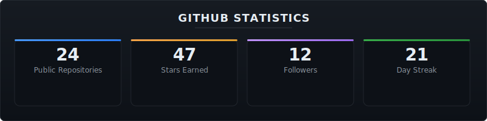
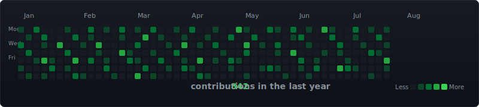

  

---

### about

Backend engineer focused on building performant, scalable distributed systems.

Node.js · TypeScript · Rust · Linux

Open source advocate. Infrastructure enthusiast. Terminal native.

---

### current focus

- Distributed systems and message queue architectures
- High-throughput API design and optimization
- Developer tooling and automation
- Open source contributions to the Node.js ecosystem

---

### featured projects

[**sift**](https://github.com/usfmah/sift) · High-performance log tailing utility for real-time observability.
Built with Rust. Processes 50k+ lines/sec with minimal memory overhead.

[**forge**](https://github.com/usfmah/forge) · Scaffolding CLI for opinionated Node.js microservices.
TypeScript-first. Generates validated project structures in under 200ms.

[**hedron**](https://github.com/usfmah/hedron) · Minimal reverse proxy for local development.
Edge-routed. Sub-millisecond overhead. Single binary.

---

### tech stack

  

---

### github stats

  

---

### contribution graph

  

---

### contact

[**email**](mailto:usfmah@pm.me)
[**linkedin**](https://linkedin.com/in/usfmah)
[**pgp**](https://github.com/usfmah.gpg)

---

  Handcrafted · Minimal · Open Source
   
  profile built with ❤️ and a terminal

