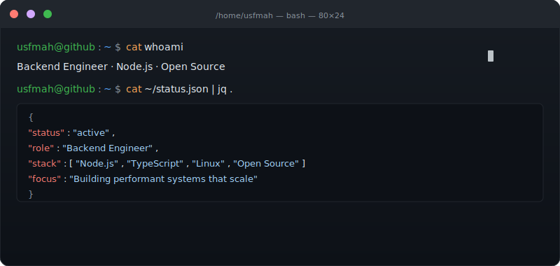
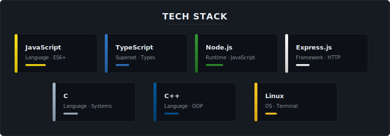

  

---

### about

CS student learning backend engineering through Node.js, TypeScript, and Linux.

Building projects to understand how systems work under the hood.

Open source enthusiast. Terminal native.

---

### current learning

- Exploring distributed systems and message queue architectures
- Studying high-throughput API design and performance optimization
- Learning developer tooling and workflow automation
- Exploring the Node.js open-source ecosystem and understanding how production projects are built

---

### tech stack

  

---

### contact

  
  

---

